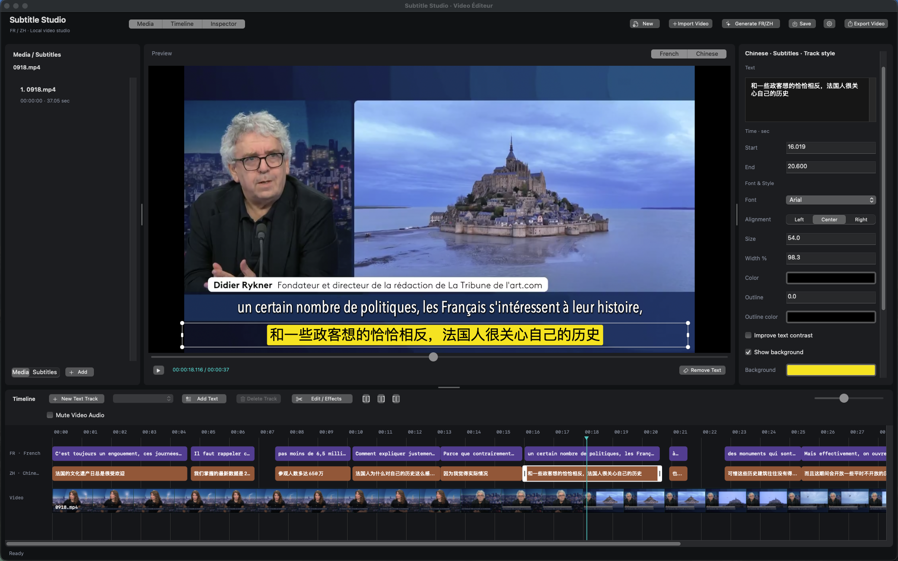

# Video Éditeur · 字幕工坊

[简体中文](README.zh-CN.md) | **English**

A native macOS video editor built with Swift and AppKit, featuring French–Chinese subtitles, a dark three-pane workspace, AVPlayer preview, a bilingual timeline, and burned-in video export using H.264/AAC or 10-bit HEVC.



## Getting started

Open the packaged application at `dist/VideoEditeur.app`, or run:

```sh
open dist/VideoEditeur.app
```

To rebuild, use macOS 13+ and Swift 5.10+ with Command Line Tools installed:

```sh
./scripts/build-app.sh
```

This build is intended for local use. It uses ad-hoc signing, has no App Sandbox, and includes no notarization or App Store distribution setup. External tools are not bundled.

The icon source is `Assets/Brand/video-editeur-logo-v1.png`. The packaging script uses macOS `sips` and `iconutil` to generate all icon sizes and include them in the app. Do not edit the contents of `dist` manually.

## Basic workflow

1. **Import Video**, or drag an MP4/MOV into the preview. This starts a new project. To append video or music to the current project, use **Media → Add Media** or the corresponding command in the video editing menu (`⌘I`). Multiple files can be selected.
2. FR/ZH timeline rows are hidden in a new project until you click **Generate FR/ZH**; projects with existing subtitles show them automatically. Generate French–Chinese subtitles. The app extracts audio, transcribes French using the installed skill's Whisper script, and translates through your signed-in Codex session. The status bar shows progress; generation can be cancelled.
3. Switch between **Media** and **Subtitles** in the left panel. Media lists video and music; Subtitles lists language and text tracks with cue counts, rather than every subtitle line. Selecting a track selects its current or first cue. Select individual cues in the timeline or preview, then edit text, start/end times, font, size, color, outline, background, and position in the right panel. Press Return to commit numeric values.
4. Drag subtitle clips to move them in time, or drag their edges to change duration. Cues on the same language track cannot overlap. In the preview, drag text to move it, corner handles to resize the font, and side handles to adjust text-box width and wrapping without changing font size. Properties update during dragging; one undo restores the entire drag. Use the timeline slider to zoom.
5. Select a subtitle track and click **Add** to insert a cue of up to two seconds at the playhead. Use the trash button to delete the selected cue. Undo and redo are available with `⌘Z` and `⇧⌘Z`.
6. The preview's **French / Chinese** switches are independent: enable either language, both, or neither. The timeline, preview, and export respect this choice; switching the left panel category does not change it. The timeline and properties follow the current subtitle during playback or seeking, but preview selection outlines are hidden while playing. Editing text or time values pauses playback. Style changes apply to every cue on the same language track and clear its individual style overrides; text and timing changes affect only the selected cue.
7. **Save** creates a `.frzh` project; reopen it with `⇧⌘O`. Launching the app starts a blank new project instead of restoring the previous session. Closing the window or quitting prompts to Save, Don’t Save, or Cancel when there are unsaved changes. Cancelling the save dialog also cancels quitting. Autosave writes only a recovery copy and does not overwrite the explicitly saved project; use Open Project to open saved `.frzh` files or `~/Library/Application Support/VideoEditeur/Recovery.frzh` manually. Missing video or music files can be relocated.
8. **Export Video** creates an MP4 with visible subtitles, text, and styles burned in. Editing is disabled during export. The destination is replaced only after success; cancellation preserves an existing destination file.

Default French subtitles use Avenir Next Condensed at size 70, with white text and a black outline above the Chinese line. Chinese uses Arial at size 60, with black text on yellow. Both subtitle languages default to 98% text-box width. Existing projects retain their saved styles. Font sizes are relative to a 1080-pixel frame height. Positions are relative to the visible video area, with Y increasing from bottom to top. Preview and export share text layout and rendering code.

## Editing text and the workspace

- **Width %** accepts 10–100; leave it blank for automatic width. Dragging a side handle keeps the opposite edge fixed and stays within the video frame. Older projects without a width value retain automatic layout.
- Select left, center, or right text alignment in the style inspector. Center is the default. Alignment positions text within its box; increase the width to see a clearer difference for short lines. The background follows the text. Style changes apply to the current language or text track and support undo and persistence.
- The readability option adds a contrasting outline and subtle shadow: black around light text, white around dark text. It is enabled by default for light text without a solid background. Disable it to use the custom outline instead.
- **New Text Track** creates an independent track with a two-second text clip using Arial by default. Existing tracks retain their font. Edit its content, timing, and style in the inspector. Choose a track in the dropdown and use **Add Text** to insert more clips at the playhead. Clips on one track cannot overlap; separate tracks can display simultaneously. Text tracks are saved and burned into exports, independently of language visibility and subtitle regeneration.
- Select a text track and use **Delete Track** to remove it and all its clips. Undo restores the entire track. French, Chinese, and video tracks are unaffected.
- **Delete** or **Fn+Delete** removes the selected subtitle or text clip. Inside text or property fields, it deletes characters instead.
- **Space** toggles playback. Holding it down toggles only once. It remains a normal space in text fields and does not control playback from dialogs or other windows.
- The top **Media / Timeline / Subtitle Properties** controls independently show or hide panels. Drag the horizontal divider to resize the preview and timeline; drag the vertical dividers to resize side panels. Double-click a divider to restore its default size. Panel sizes and visibility persist across launches.

Use **New** (`⌘N`, or File → New Project) for a blank project. This clears media, subtitles, text tracks, preview, playhead, and undo history. Unsaved work prompts you to save, discard, or cancel; cancelling a save does not clear the project. Source files and saved projects are not deleted. Finish or cancel generation/export before starting a new project.

Drag local videos or audio files from Finder onto the Media card area to append them to the current project. Multiple files are supported; the area highlights when the drop is accepted. Unsupported files are rejected. Dropping clears the filename filter so new cards are visible. Undo with ⌘Z. Drops are disabled during generation/export, and a locked video track rejects video additions. Dropping onto the central preview still starts a new project.

The Media panel uses a responsive thumbnail-card grid, with a **+** import button and filename search at the top. Cards show a preview (or a music-note icon), duration, an Added badge, and the filename below. Click to select the corresponding timeline clip; double-click to open editing settings. Hover to see the full name. Video previews load asynchronously from the retained source range. The Subtitles tab keeps its track list. The sidebar scrollbar uses an auto-hiding overlay and does not reserve a permanent strip on the right.

Drag a video card from Media onto the video track to insert a copy. The insertion line snaps before or after a clip; dropping past the sequence end appends it. The copy retains the card’s source range and effects, with a new clip ID and no incoming dissolve. Existing video and subtitle timings ripple forward; existing subtitles are not copied to the new clip. Music keeps its absolute timing. Use ⌘Z to undo. Locked tracks and active generation/export reject the drop.

## Multiple video tracks

Video tracks render at the full canvas size, preserving aspect ratio with black bars where needed. Upper visible tracks cover lower tracks; all unmuted audio tracks are mixed. PiP sizing, positioning, preview dragging, and PiP controls have been removed. Existing PiP projects reopen as ordinary video tracks, preserving source files, timing, effects, and track states; their former position and size no longer affect playback or export.

- Drag a Media card into the area below the timeline to create a new video track, or onto an existing additional track to place another clip at the drop time. Each track supports multiple clips; overlapping clips on the same track are rejected.
- Drag a timeline video clip by its body onto **any other video track**, including Video 1, or into the bottom drop area to create a new track. This moves the original clip with its source range, effects, and ID. Other clips and music stay in place; cross-track moves leave subtitles at their existing times. Existing destination tracks apply their own hide/mute settings. A turquoise outline marks a valid placement; red means overlap or a locked destination. Release to commit once, ⌘Z to undo, or Esc to cancel. Drag clip edges to trim.
- Split at the playhead with ⌘B or the split button. Both pieces stay on the same track. Delete removes only the selected clip; deleting the last clip removes the empty row.
- Right-click an additional video track for **Move Track Up**, **Move Track Down**, or **Delete Track**. Moving a track changes the order in which videos cover one another; deleting it removes every clip in that track. Locked tracks cannot be changed. Undo restores the operation.
- Double-click a clip to edit its start time, source in/out, fades, brightness, contrast, and saturation. Each track has independent lock, hide, and mute buttons; they affect every clip on that track and are saved with the project.
- The bottom Video 1 track supports dragging a clip body to an exact start time, including leaving an initial gap (for example, 00:05). Other video clips and music keep their positions; associated subtitles follow the moved clip. Same-track overlaps are rejected. Remove an adjacent dissolve before moving a clip involved in that transition. Card drops still insert copies, and trimming retains ripple editing and subtitle remapping. Background music remains at its absolute time.

The project ends at the latest video endpoint. Gaps reveal lower tracks, or black if no track supplies an image. Preview and export use the same composition and project speed. Edits support undo/redo and saving; generation/export disables editing.

## Playback and export speed

Use the speed menu beside Play to choose 0.25×, 0.5×, 0.75×, 1×, 1.25×, 1.5×, or 2×. This is a whole-project setting: both preview and exported video use it. At 2×, output duration is halved; at 0.5× it doubles. Video, subtitles, text, transitions, original audio, and background music are retimed together, with audio pitch preservation. The editing timeline and its timestamps stay in original project time. Transcription also uses original timing. Speed is saved in the project and supports undo; old projects default to 1×. This does not provide individual clip speed ramps.

## Multiple videos, effects, and HDR

- Append media using **Add Media** (`⌘I`). Videos are arranged sequentially. The top **Import Video** action still starts a new project.
- Select a video in the media list or timeline. Use the video editing menu to move it earlier or later, or delete it. Delete also removes a selected video clip; `⌘Z` restores it.
- To split, place the playhead inside a clip and use the split command (`⌘B`). Splitting inside a dissolve is not allowed.
- Trim by dragging video clip edges, or double-click a clip to open the editing/effects dialog and enter source in/out times. Source files remain unchanged.
- The same dialog provides fade-in/out, a dissolve from the preceding clip, brightness, contrast, and saturation. Apply updates the preview. Dissolves shorten the total duration and crossfade audio; the first clip has no incoming dissolve.
- Subtitles and text tracks are repositioned when video clips are trimmed, split, reordered, or deleted. Text spanning clips is split into separate entries; subtitle ownership switches at the dissolve midpoint. Changes support undo. Subtitle generation uses audio from the edited video sequence, rather than only the first source file.
- The first clip determines canvas size and output frame rate. Other clips are fitted proportionally and centered, with black bars as needed. Projects retain all media paths, source ranges, and effect settings; older projects remain supported.
- Before export, the app shows source color information and available formats. An all-HLG or all-PQ timeline offers the corresponding **BT.2020 / HEVC Main10** output. SDR or mixed transfer-function projects offer **BT.709 / H.264**. Unsupported local encoding capabilities produce an error.
- HDR composition uses half-precision floating point, with subtitles composited as a separate transparent layer before 10-bit encoding. The source image is not first reduced to 8-bit. Export is lossy re-encoding, not bit-exact preservation. Dolby Vision support uses the compatible base layer without dynamic metadata; HDR10 mastering/peak metadata is not passed through. Appearance also depends on the source and HDR display.

Three timeline buttons next to the editing/effects control provide **Split**, **Remove Before Playhead**, and **Remove After Playhead**. They act on selected video or music; without a selection, the video under the playhead is used. The playhead must be inside the clip. Video trimming closes the timeline gap and adjusts subtitles; music trimming leaves video and subtitles in place. Source files are never deleted.

Video clips use a teal header with filename and duration, a filmstrip in the middle, and a source-audio waveform below. Dark seams separate clips; the selected clip has a white rounded outline and trim handles. Waveforms load asynchronously from the retained source range and show the first source audio track, independently of mute and effects. Missing or unavailable audio shows a baseline. These visual separators do not introduce playback gaps.

The video track displays filmstrip thumbnails sampled from each clip's retained source range. Trimming, splitting, or replacing a video reloads them asynchronously. Thumbnails show the original source, without subtitle or color effects.

The left side of the video track has three controls: **Lock**, **Hide**, and **Mute**. Lock blocks video clip edits (including split, trim, reorder, delete, and appending videos), while selection and playback remain available. Hide removes source video imagery from both preview and export, leaving a black canvas with any visible subtitles; audio is controlled separately. Mute synchronizes with **Mute Original Video** and leaves background music unchanged. All three states are saved with the project and support undo.

## Background music and muting video audio

Use **Media → Add Media** to select MP3 files or other audio formats supported by the system. Music appears in the media list and on separate green timeline rows, starting at the playhead with a default volume of 30%.

The full audio duration is retained on import. Scroll horizontally to see longer music; it does not extend the exported video. Drag clips to move them, drag edges to trim, or double-click to edit timing and volume. The shared editing/effects button also opens music settings when music is selected.

Select music and place the playhead inside its clip to use **Split (`⌘B`) / Remove Before / Remove After**. Splitting retains source positions and volume without moving video or subtitles. Delete removes the selected music; `⌘Z` restores it. Clicking the timeline ruler seeks while keeping the music selected. There are no separate add/edit/delete music buttons.

Use the speaker button on the left of each video track to mute its original audio; the main track and each additional video track are independent, and background music remains audible. The separate **Mute Video Audio** toolbar checkbox has been removed, along with its empty toolbar row. Preview and export share the same mix. Music beyond the video end is not exported; shorter music does not loop automatically. Multiple music clips can overlap. Paths, source ranges, start positions, volume, and mute state are saved with the project. Missing music can be relocated when reopening.

Subtitle transcription always uses the original video audio, excluding background music and ignoring the mute switch.

If an older version shortened imported music to the remaining video duration, import it again or extend its right edge to restore more of the source. Existing manual trims are not automatically changed.

## Region text removal: solid-color covering

1. Pause and enable the region text-removal tool at the bottom right of the preview. Start dragging from a pixel with the background color you want to preserve, then select the text region.
2. Press **Delete** to configure coordinates and the time range within the clip. The default fill is sampled from the first mouse-down position. Choose a manual color or enable automatic per-frame sampling from the selection's bottom edge. For automatic sampling, leave some text-free background along that edge.
3. Apply the cover. Preview and export use the same region. Undo with `⌘Z`; press Esc or click the tool again to exit selection mode. The video editing menu provides management of saved regions.

This is a solid-color cover suited to uniform news banners, not texture reconstruction or motion tracking. The default time range covers the whole clip; adjust it to the text's actual appearance. Regions stay fixed in the frame and are drawn before app-added subtitles. Source files remain unchanged. Settings are saved using source-video times and follow trimming/splitting. Filmstrip thumbnails still show the original source.

## Interface language

Chinese is the default regardless of the macOS language. Choose **中文 / English** under the app's interface-language menu or in settings, then restart the app. The choice persists.

English covers app menus, panels, editing controls, generation progress, and application errors. Native file dialogs follow macOS. Interface language does not translate existing subtitles, project names, or paths, and does not change French–Chinese generation targets.

## Local dependencies and project data

Configure paths through the toolbar gear or `⌘,`:

| Tool | Default path / requirement |
| --- | --- |
| ffmpeg | `/opt/homebrew/bin/ffmpeg`; used for audio extraction, no libass required |
| Python | `/opt/homebrew/anaconda3/bin/python3`; requires `mlx-whisper` or `faster-whisper` |
| Codex | `/Applications/ChatGPT.app/Contents/Resources/codex`; sign in beforehand; uses your default model and existing session, no API key required |
| Subtitle skill | `~/.codex/skills/video-generate-fr-zh-subtitles`; requires `SKILL.md` and `scripts/transcribe_srt.py` |

Transcription runs locally and may download a Whisper model on first use. Subtitle text is sent to Codex for online translation and uses account quota; source video and audio are not sent to Codex. Codex runs read-only and returns structured translations with IDs, rather than executing media commands.

MLX is tried first, with faster-whisper as fallback. MLX and video export checks need access to Metal and system media services; a restricted sandbox can prevent these checks from running correctly.

Recovery data, task logs, temporary audio, and internal SRT files live in `~/Library/Application Support/VideoEditeur/`. Relaunching restores the previous project. Interrupted generation retains batch caches for continuation. Manual edits start a new task so retries do not overwrite them. Unnamed projects are archived under `Recovered Projects/` before switching videos. Task caches are not automatically removed; you can clean `Jobs/` when no task is running.

Projects reference media without copying it. Share the source files alongside a `.frzh` project. Inputs must be decodable by AVFoundation. This version exports burned-in video only, with no standalone subtitle-export button. It does not include picture-in-picture layers, per-clip speed ramps, keyframes, or soft-subtitle muxing.

## Building and verification

```sh
# Core checks: no network or account required
./scripts/check.sh
# Build and package the current application
./scripts/build-app.sh
# Rendering/encoding in a normal macOS session; use a valid local video
dist/VideoEditeur.app/Contents/MacOS/VideoEditeur --smoke-export input.mp4 /tmp/output.mp4
# Process cancellation, timeout, recovery, export cancellation, source protection
dist/VideoEditeur.app/Contents/MacOS/VideoEditeur --smoke-services input.mp4 /tmp/video-editeur-service-checks
# Real Whisper + Codex integration: downloads/uses models and consumes account quota
dist/VideoEditeur.app/Contents/MacOS/VideoEditeur --smoke-generate french.mp4 /tmp/video-editeur-generation
```

`CoreChecks` uses a standalone assertion runner without the full Xcode XCTest runtime. Checks cover SRT parsing, time boundaries, translation IDs, project persistence, geometry, and editing rules. Use a fresh directory for service checks, which intentionally preserve checkpoints.

For media regression checks, rebuild first, then run `./scripts/smoke-media.sh` or `./scripts/check-editing.sh`. These require ffmpeg/ffprobe; editing/HDR checks also require libx265. The editing script generates temporary landscape/portrait sources, audio tracks, and HLG/PQ gradients to check sequence duration, transcription audio, 10-bit output, color tags, and highlight gradations.

See [VALIDATION.md](VALIDATION.md) for recorded results and limitations. Real generation sends subtitle text and consumes account quota; it is unnecessary for ordinary UI changes.

## Code structure and contribution notes

- `Sources/SubtitleCore`: versioned projects, subtitle/music models, clip time mapping, SRT, translation merging, geometry, and interface localization.
- `Sources/VideoEditeur`: AppKit controllers, timeline, shared text rendering, custom AVVideoCompositing, H.264/AAC and 10-bit HEVC export, and local tool tasks.
- `Tests/CoreChecks`: core checks independent of network access and accounts.

Subtitle times use integer milliseconds and half-open intervals `[start, end)`. Stable UUIDs associate transcriptions with translations. French and Chinese tracks are edited separately. Export captures a project snapshot, applies source rotation, and rounds dimensions to even values for H.264 encoding.

See [AGENTS.md](AGENTS.md) for repository conventions covering compatibility, undo, preview/export consistency, music duration, and verification. Documentation-only changes do not require an application rebuild.
