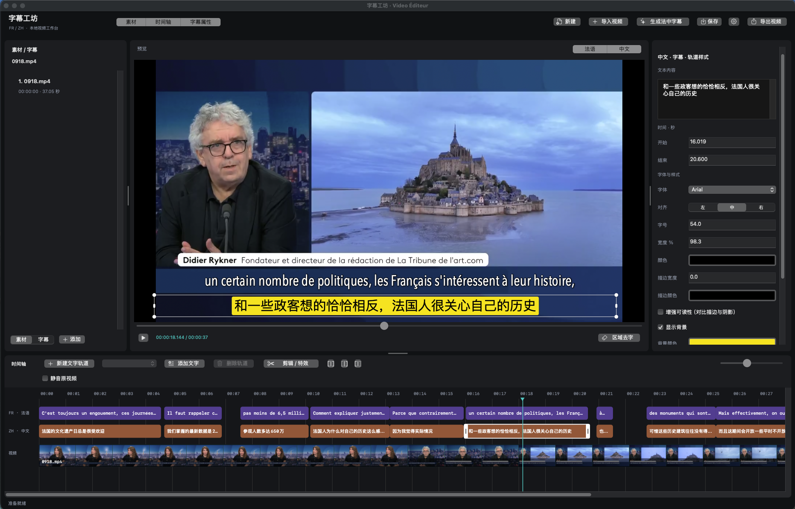

# 字幕工坊 · Video Éditeur

**简体中文** | [English](README.md)

Swift + AppKit 原生 macOS 多视频剪辑与法中字幕编辑器。深色三栏工作区，AVPlayer 预览，双语字幕时间轴，原生 H.264/AAC 与 HEVC 10-bit 烧录导出。



## 启动

已构建应用：`dist/VideoEditeur.app`，双击即可启动，或：

```sh
open dist/VideoEditeur.app
```

重新构建（macOS 13+，Swift 5.10+，仅需 Command Line Tools）：

```sh
./scripts/build-app.sh
```

此版本用于当前 Mac 自用，采用本地 ad-hoc 签名，无 App Sandbox、不含公证和商店分发配置。工具依赖不会打进安装包。

应用图标源图位于 `Assets/Brand/video-editeur-logo-v1.png`。打包脚本使用系统 `sips` 和 `iconutil` 自动生成各尺寸图标并写入应用包，无需手动修改 `dist`。

## 使用

1. **导入视频**或将 MP4/MOV 拖入中间预览区。这会开始新工程；向当前工程追加视频或音乐请用素材页的 **添加素材**（支持多选）或菜单「视频剪辑 → 添加素材…」（⌘I）。
2. 点击 **生成法中字幕**。应用提取音频，使用已安装 skill 的 Whisper 脚本转写法语，再调用已登录的 Codex 翻译。状态栏显示阶段，可取消。
3. 左下「素材 / 字幕」切换列表分类：素材页显示视频和音乐素材，字幕页按法语、中文和文字轨道显示名称及条数，不再逐句列出字幕。点击字幕轨道可定位其中当前时刻或第一条字幕；时间轴片段和预览文字可选中具体字幕。右侧编辑文字、起止秒数、字体、字号、颜色、描边、背景和位置；数值修改后按回车提交。
4. 时间轴中拖动字幕改变时间，拖动左右边缘改变时长；同语言字幕不重叠。预览中拖动文字改变位置，拖动选中框四个角的手柄改变字号，左右中点手柄调整文本框宽度与换行（字号保持不变）；拖动过程中右侧属性实时更新，松开鼠标后一次撤销即可恢复整次拖动。底部滑块缩放时间轴。
5. 在左侧字幕页选中对应轨道，再点 **添加**，在播放头位置新增最多两秒字幕；垃圾桶删除当前选中的单条字幕；素材页的 **添加素材** 用于追加视频或音乐。支持 `⌘Z` / `⇧⌘Z`。
6. 预览右上的 **法语 / 中文** 保持独立开关：只选法语显示法语，只选中文显示中文，两者都选显示双语，两者都关闭则隐藏字幕。时间轴、预览和导出同步遵循选择；左侧分类切换不改变这些开关。播放或拖动进度时，时间轴与属性跟随当前字幕；播放时预览不显示选中框。开始编辑文本或时间数值时自动暂停播放。宽度、位置、字体、字号、颜色、描边和背景的修改自动应用于同语言所有字幕，并清除该语言已有的单条样式覆盖；另一种语言不受影响。文字内容与起止时间仍只修改当前字幕。
7. **保存**生成 `.frzh` 工程，`⇧⌘O` 重新打开；自动保存保留字幕、样式和视频引用。视频或音乐移动后可重新定位。
8. **导出视频**输出 MP4，烧录当前可见语言、文字和样式；导出期间冻结编辑。成功才替换目标文件，取消不损坏已有目标文件。

默认法语使用 Avenir Next Condensed、字号 70，白字黑描边在上；中文使用 Arial、字号 60，黑字黄底在下。两种语言的字幕框默认宽度均为 98%。已有工程保留保存的样式。字号以 1080 像素画面高度为基准；位置为视频可见区域中的百分比，Y 从底部向上。字体、排版和坐标由预览与导出共用的绘制代码处理。

## 本机依赖与数据

在工具栏齿轮或 `⌘,` 中修改路径：

- ffmpeg：默认 `/opt/homebrew/bin/ffmpeg`，只用来提取音频，不需要 libass。
- Python：默认 `/opt/homebrew/anaconda3/bin/python3`，需 `mlx-whisper` 或 `faster-whisper`。
- Codex：默认 `/Applications/ChatGPT.app/Contents/Resources/codex`，需预先登录；沿用默认模型与登录，不需 API Key。
- Skill：默认 `~/.codex/skills/video-generate-fr-zh-subtitles`，需要 `SKILL.md` 和 `scripts/transcribe_srt.py`。

语音转写在本机执行，首次使用可能下载 Whisper 模型。字幕文本发送给 Codex 在线翻译，占用对应账户额度；原视频和音频不发送给 Codex。Codex 以只读模式运行，只返回带 ID 的结构化翻译，不负责执行音视频命令。

MLX 优先，失败后尝试 faster-whisper。独立应用正常启动时可访问 Metal；不要把应用的 MLX/视频导出测试放入屏蔽 GPU 或系统媒体服务的沙箱。

工程恢复、任务日志、临时音频及内部 SRT 存放在 `~/Library/Application Support/VideoEditeur/`。关闭重开恢复上次工程；未完成任务保留批次缓存，可继续生成。人工编辑后会开始新任务，以免重试覆盖新修改。切换视频前未命名工程会归档到 `Recovered Projects/`。任务缓存不会自动清理，可在不运行任务时自行清理 `Jobs/`。

当前版本只提供烧录视频导出，不提供独立字幕导出按钮。工程引用视频和音乐文件，不复制媒体；分享 `.frzh` 时仍需同时提供对应媒体文件。输入限 AVFoundation 可解码的视频；支持顺序多视频剪辑、基础特效和 HLG/PQ 10-bit 输出；不包含多层画中画、单片段速度曲线、关键帧和软字幕封装。

## 验证

```sh
./scripts/check.sh
# 正常 macOS 会话中验证渲染/编码（输入需是有效本地视频）
dist/VideoEditeur.app/Contents/MacOS/VideoEditeur --smoke-export input.mp4 /tmp/output.mp4
# 子进程取消、超时、失败恢复、导出取消与源文件保护
dist/VideoEditeur.app/Contents/MacOS/VideoEditeur --smoke-services input.mp4 /tmp/video-editeur-service-checks
# 真实 Whisper + Codex 集成测试，会使用模型与账户额度
dist/VideoEditeur.app/Contents/MacOS/VideoEditeur --smoke-generate french.mp4 /tmp/video-editeur-generation
```

`CoreChecks` 使用独立断言执行器，避免要求完整 Xcode 的 XCTest 运行时。包含 SRT、时间边界、翻译 ID、工程格式和坐标转换测试。不要复用服务测试的旧目录，因为它有意保留检查点。

更多实际验证结果与限制见 [VALIDATION.md](VALIDATION.md)。上述真实生成检查会发送字幕文本并使用账户额度；普通界面修改无需运行。媒体回归前请重新构建应用，确保检查当前代码。

## 代码结构

- `SubtitleCore`：版本化工程、字幕与音乐模型、视频剪辑时间映射、SRT、译文合并、坐标计算与界面本地化。
- `VideoEditeur`：AppKit 控制器、时间轴、共用文字渲染、自定义 AVVideoCompositing、H.264/AAC、HEVC 10-bit 导出，以及本机工具任务。
- `Tests/CoreChecks`：不依赖网络和账户的核心测试。

字幕时间采用整数毫秒和半开区间 `[start, end)`。源转写和译文通过稳定 UUID 对应，法中轨道分别编辑；导出捕获工程快照。画面应用源视频旋转变换，尺寸调整到最近的偶数以满足 H.264 编码要求。

右侧「宽度 %」可输入 10–100，留空恢复自动宽度；左右拖动保持另一侧边缘固定，限制在视频画面范围内。旧工程缺少宽度字段时保持原来的自动排版。

顶部「素材 / 时间轴 / 字幕属性」是三个独立的面板开关：点击即可收起或展开，选中表示已显示。收起面板后预览自动扩大，重启后保留面板显示设置。

时间轴顶部「新建文字轨道」会添加独立轨道和一段两秒说明文字。选中片段后在右侧编辑内容、起止时间、字体和位置；拖动片段移动时段，拖动左右边缘调整显示时长。用轨道下拉框选择目标，再点「添加文字」可在播放位置继续添加。同轨片段不能重叠，不同轨道可以同时显示。文字轨道随工程保存，并烧录到导出视频；法语／中文开关和重新生成字幕不影响文字轨道。可用左侧删除按钮删除选中文字片段，撤销可恢复。

选中字幕或文字片段后，按 Delete（也支持 Fn+Delete）删除当前片段，⌘Z 撤销。编辑文本或属性输入框时，Delete 仅删除字符。

在时间轴顶部下拉框选择文字轨道，点击「删除轨道」可移除该轨道及其中全部文字片段；⌘Z 可完整恢复。法语、中文和视频轨道不受影响。

「增强可读性（对比描边与阴影）」为文字添加对比轮廓和轻微阴影；浅色文字配黑色轮廓，深色文字配白色轮廓。无实色背景的浅色文字默认启用，可手动关闭以恢复自定义描边。效果按轨道应用并随工程保存，预览和导出共用绘制。

预览区与时间轴之间的横向分隔线支持上下拖动，调整两部分高度；中央短横线为拖动提示，双击恢复默认高度。显示设置会记住，收起时间轴时分隔线一并隐藏。

素材区与预览区、预览区与字幕属性区之间也支持左右拖动分隔线，分别调整侧边面板宽度，预览自动适应剩余空间。宽度会记住，双击分隔线恢复默认；收起对应面板时分隔线一并隐藏。

可从 Finder 将本地视频或音频拖入 Media 素材卡片区域，追加到当前工程，支持一次多个文件。允许拖入时区域高亮，不支持的文件不接收；导入后清空文件名筛选以显示新卡片，⌘Z 可撤销。生成/导出期间不接受拖入，视频轨道锁定时拒绝追加视频。拖到中间预览区仍是开始新工程。

素材面板采用随宽度调整列数的缩略图卡片网格，顶部提供 **+** 导入按钮和文件名搜索。卡片显示预览（音乐使用音符图标）、时长、已添加标记及下方文件名；单击选中时间轴片段，双击打开剪辑设置，悬停查看完整名称。预览从保留的源范围异步加载，字幕页仍使用轨道列表。右侧滚动条使用自动隐藏的浮层样式，不再固定占据右侧条带。

可以把 Media 视频卡片拖到视频轨道，按插入线位置加入副本。落点吸附到片段前后边界，拖到末尾之后则追加；副本保留该卡片的源范围和特效，使用新 ID，不带入叠化。原视频与字幕顺延，已有字幕不会复制到新片段，音乐保持绝对时间。⌘Z 可撤销；轨道锁定或生成/导出期间不接受拖入。

## 播放与导出速度

播放按钮旁的倍速菜单支持 0.25×、0.5×、0.75×、1×、1.25×、1.5×、2×。这是整个工程的速度，同时影响预览和导出：2× 导出时长减半，0.5× 时长翻倍。视频、字幕、说明文字、转场、原声和背景音乐同步变速，声音采用保持音高处理。编辑时间轴及时间标签仍按原始工程时间显示，转写也使用原始时间。速度随工程保存并支持撤销，旧工程默认 1×；不提供单片段速度曲线。

## 多视频剪辑、特效与 HDR

- 追加素材：左侧 **素材 → 添加素材**，或菜单 **视频剪辑 → 添加素材…**（⌘I）；素材按顺序排列。顶部「导入视频」仍用于开始新工程。
- 选择片段：单击素材列表或时间轴的视频块。通过 **视频剪辑 → 视频片段前移 / 后移** 排序，通过菜单删除片段；选中视频后 Delete 也可删除，⌘Z 撤销。
- 分割：将播放头放在片段内，菜单 **视频剪辑 → 在播放头分割素材**（⌘B）；叠化区域内不允许分割。
- 裁剪：拖动视频块左右边缘，或双击素材/视频块，打开 **剪辑 / 特效**，输入源视频起止秒数。裁剪不修改源文件。
- 特效：同一面板设置淡入淡出、与前片段的叠化时长，以及亮度、对比度、饱和度。点击「应用」更新预览。叠化会缩短总时长，音频同时交叉淡化；第一片段不设叠化。
- 字幕随片段的裁剪、分割、排序和删除重新定位，包括说明文字。跨片段文字会分成独立条目，叠化中点切换字幕。所有修改可撤销；生成字幕时使用剪辑后的混合音轨，不再只转写第一个视频。
- 第一片段决定工程画布大小与输出帧率，后续素材等比居中，比例不同时留黑边。工程保留全部素材路径、裁剪范围和特效参数，旧工程仍可打开。
- 导出前显示每个素材的检测结果和可选格式。全时间轴为 HLG 或全为 PQ 时，提供对应 **BT.2020 / HEVC Main10** 输出；SDR 或混合传递曲线工程仅提供 **BT.709 / H.264**。本机编码器不支持时会明确报错。
- HDR 视频合成使用半精度浮点处理，字幕作为独立透明图层合成后再编码为 10 位；不将源画面先压成 8 位。输出是有损重编码，不能承诺逐位无损。Dolby Vision 仅处理兼容基础层，不保留动态元数据；HDR10 静态母版/峰值元数据不透传。真实观感仍取决于素材和支持 HDR 的显示设备。

回归验收（需 ffmpeg/libx265）：`./scripts/check-editing.sh`。脚本生成临时横竖屏、双音轨及 HLG/PQ 灰阶素材，验证拼接时长、混音转写输入、10 位输出、色彩标记和高亮灰阶保持。

时间轴「剪辑 / 特效」右侧新增三个快捷按钮，从左到右为：**分割**、**删除播放头左侧**、**删除播放头右侧**。作用于所选视频或音乐片段（未选中时使用播放头下的视频），不会删除本机源文件；播放头必须位于片段内部。操作后可用 ⌘Z 撤销。视频左右删除会收紧后续时间轴并同步调整字幕；音乐裁剪不移动视频或字幕。

视频片段顶部为青色标题栏，显示文件名和时长；中间为连续缩略图，底部为源音频波形。片段之间使用深色分隔，选中时显示白色圆角边框与裁剪手柄。波形从保留的源范围异步读取第一条原声音轨，不受静音及特效影响；无音轨或音频不可用时显示基线。分隔仅影响显示，不会产生播放空隙。

视频轨道显示连续画面缩略图，按每个片段保留的源时间范围采样；裁剪、分割或替换视频后自动重新加载。缩略图在后台分批显示，缩放时间轴时按时间位置选择对应画面，文件名使用暗底保持可读。缩略图展示源素材，不包含字幕和调色特效。

## 区域去字（纯色背景覆盖）

1. 暂停视频，在预览右下点击 **区域去字**，从希望保留的背景颜色处按下鼠标，拖动框选原视频中需要去掉的文字。
2. 按 **Delete**，设置坐标、片段内开始/结束时间。默认使用框选第一次按下鼠标位置的像素色。可手动改色，也可开启自动逐帧底边取色；开启时请在选区底边留少量没有文字的背景。
3. 点击 **去字**，预览和导出均覆盖该区域。⌘Z 撤销；Esc 或再次点击「区域去字」退出框选。菜单 **视频剪辑 → 管理去字区域** 可编辑或删除已保存的区域。

这是背景色覆盖，适合新闻纯色底条，不是复杂纹理的无痕修复，也不做运动跟踪。遮盖默认作用于当前片段全长，请按文字实际出现时间调整区间；位置固定于画面。去字先于新增字幕绘制，不影响应用内添加的字幕。原文件不变，设置保存在工程中，裁剪/分割后沿用源视频时间。轨道缩略图仍展示原素材。

空格键切换播放 / 暂停，再按继续播放；编辑文字或数值时空格仍用于输入。长按空格只切换一次，弹窗和其他窗口不触发播放快捷键。

选中字幕后，在右侧「字体与样式 → 对齐」选择左、中、右，默认居中。对齐控制文字在字幕框内的位置，自动宽度下短单行文字的变化可能不明显，可增大「宽度 %」；背景色跟随文字。与其他样式一样，修改应用于当前语言或文字轨道，支持撤销及工程保存。

点击顶部 **新建**（或 `⌘N` / 文件 → 新建工程）开始空白工程：清空素材、字幕、文字轨道、预览、播放位置与撤销记录。尚未保存的工程会提示保存、放弃或取消；取消保存不会清空。已有视频和工程文件不会删除，重启后保持空白。生成或导出期间需先结束任务。

## 界面语言

默认中文，不随系统语言自动改变。通过应用菜单「字幕工坊 → 界面语言 → 中文 / English」，或齿轮设置中的「界面语言」选择；保存后重启应用生效，并记住选择。英文模式覆盖菜单、主界面、属性、剪辑、去字、生成进度和应用错误提示；系统文件选择器等由 macOS 控制。界面语言独立于字幕语言，不翻译已有字幕、工程名称或文件路径，法中字幕生成目标不变。

视频轨道左侧有 **锁定 / 隐藏 / 静音** 三个按钮。锁定后禁止视频分割、裁剪、排序、删除及追加视频，仍可选中和播放。隐藏同时作用于预览和导出：原视频画面变黑，已显示的字幕保留，声音由静音单独控制。静音只影响该视频轨道的原声，不影响背景音乐。三个状态随工程保存，支持撤销。

## 背景音乐与视频静音

在左侧 **素材 → 添加素材** 中选择视频或 MP3（支持多选，也支持系统可读取的其他音频）。视频和音乐统一显示在素材列表；音乐从当前播放头加入独立绿色轨道，保留完整音频时长，默认音量 30%。较长音乐可横向滚动时间轴查看，不会延长视频导出时长。拖动音乐片段移动，拖动左右边缘裁剪；双击音乐或点击共用 **剪辑 / 特效**，调整时间和音量。

选中音乐，将播放头放在音乐片段内部，即可使用原有三个剪切按钮：**分割（⌘B）/ 删除左侧 / 删除右侧**。音乐分割沿用源音频位置与音量，不移动视频或字幕。选中音乐后按 **Delete** 删除，**⌘Z** 撤销；点击时间尺定位播放头会保留音乐选择。已移除独立的添加、编辑、删除音乐按钮，静音统一使用轨道左侧的扬声器按钮。

点击主视频轨道左侧的扬声器按钮可关闭主轨道视频原声；附加视频轨道有各自的静音按钮，背景音乐仍然播放。预览和导出使用同一混音设置，音乐超出视频的部分不会导出，短音乐播放结束后不会自动循环。多个音乐片段可以叠加；音乐引用、起止时间、音量和静音状态随工程保存。文件移动后重新打开工程可重新定位音乐。法中字幕转写仍使用视频原声，不混入背景音乐，也不受静音开关影响。

音乐若在旧版本导入后只有视频剩余时长，可重新通过 **添加素材** 导入，或拖动原片段右边缘恢复源音频范围。当前版本保留完整音乐；已有工程的人工裁剪不会自动更改。

## 开发协作

项目维护与编码约定见 [AGENTS.md](AGENTS.md)，包括数据兼容、撤销、预览/导出一致性、音乐时长和验证要求。核心检查使用 `./scripts/check.sh`；应用打包使用 `./scripts/build-app.sh`。

## 视频多轨道编辑

视频默认占据整个画布，保持比例，不同比例以黑边补齐；上方可见轨道覆盖下方轨道，未静音轨道的声音会混合播放。已取消 PiP 的位置、大小和预览拖动功能。已有画中画工程作为普通视频轨道打开，保留素材、时间、特效和轨道状态，原来的位置和缩放不再影响预览或导出。

- 素材卡片拖到时间轴下方提示区，新建视频轨道；拖到已有附加视频轨道，在落点时间加入片段。一轨可放多个片段，同轨不允许重叠。
- 按住时间轴视频片段主体，可拖到任意其他视频轨道（包括 Video 1），或拖到下方提示区新建轨道。这是移动原片段，保留素材范围、特效和 ID，其他片段与音乐不挪动；跨轨移动时字幕保留现有时间。已有目标轨道使用自身的隐藏/静音状态。青色框表示可放置，红色表示重叠或轨道锁定。松手提交一次，⌘Z 撤销，Esc 取消；两侧边缘仍用于裁剪。
- 分割（⌘B 或工具栏按钮）后，两部分仍在同一轨道。Delete 只删除选中片段，最后一个片段删除后移除空轨道。
- 右键附加视频轨道，可上移、下移或删除整条轨道。上下移动改变覆盖顺序，删除轨道会删除其全部片段；锁定后不可修改，支持撤销。
- 双击片段，编辑开始时间、源起止时间、淡入淡出、亮度、对比度和饱和度。每轨锁定、隐藏和静音作用于该轨道所有片段，可保存和撤销。
- 最下方 Video 1 支持拖动片段主体改变实际开始时间，例如从 00:05 开始，前面保留空档。其他视频片段和音乐保持原位置，关联字幕随片段移动；同轨不允许重叠，涉及叠化的片段需先取消相邻叠化。素材拖入仍为插入副本，裁剪保留波纹编辑和字幕重映射。音乐保持绝对时间。

工程长度取最后一个视频的结束时间，空档显示下方轨道或黑色。预览、导出和工程速度一致，支持撤销、重做与保存；生成或导出期间不可编辑。静音统一使用轨道左侧扬声器按钮，工具栏不再显示独立静音复选框。

新工程默认隐藏 FR/ZH 时间轴行，点击「生成法中字幕」后展开；打开已有字幕的工程时自动显示。
